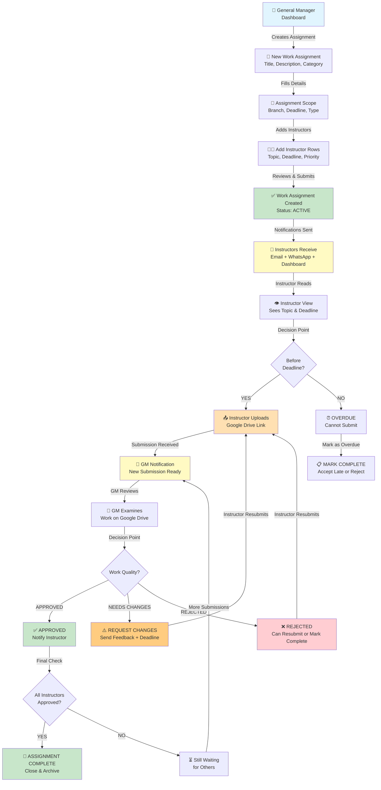
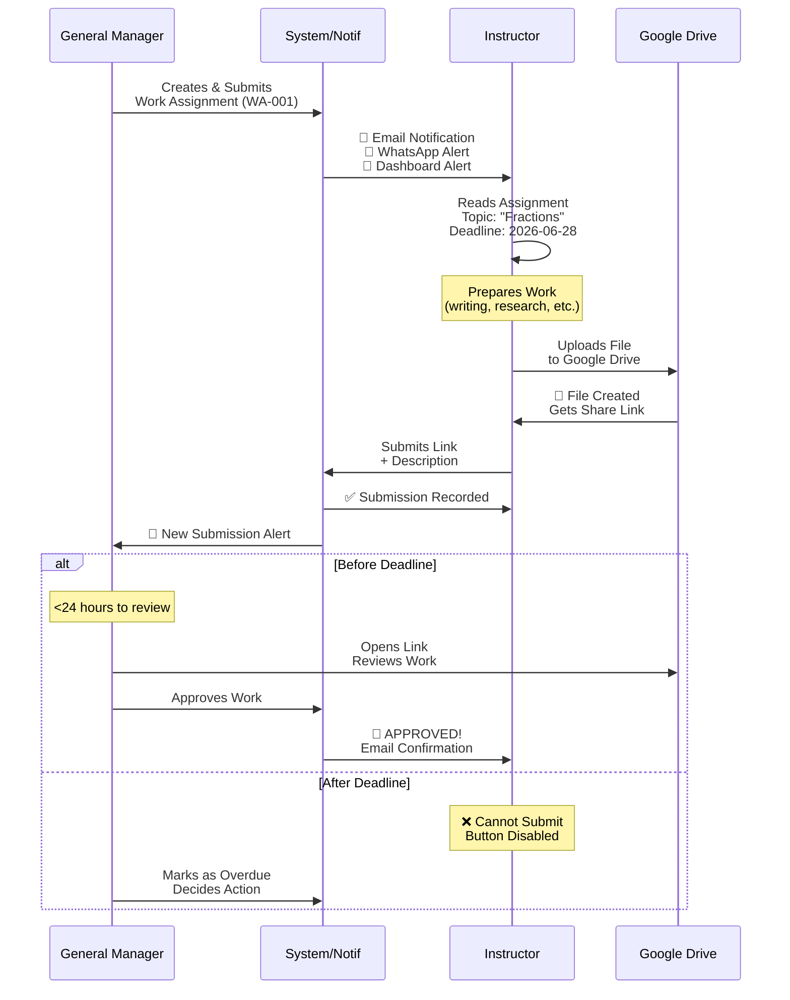
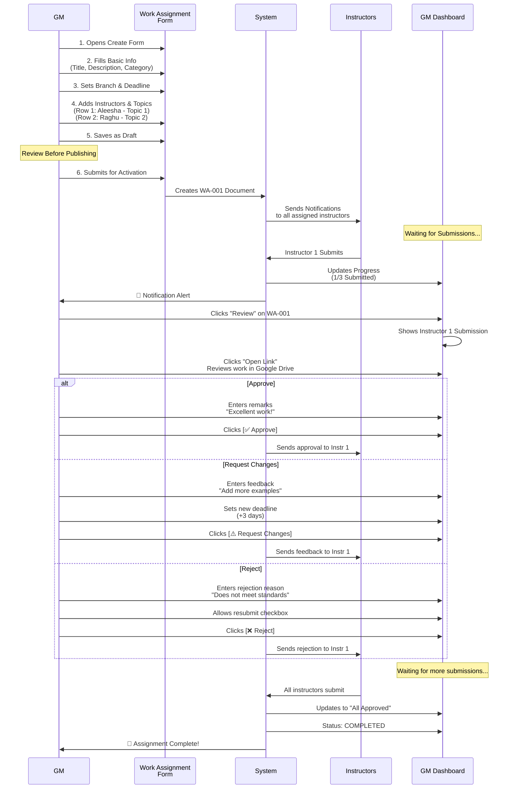
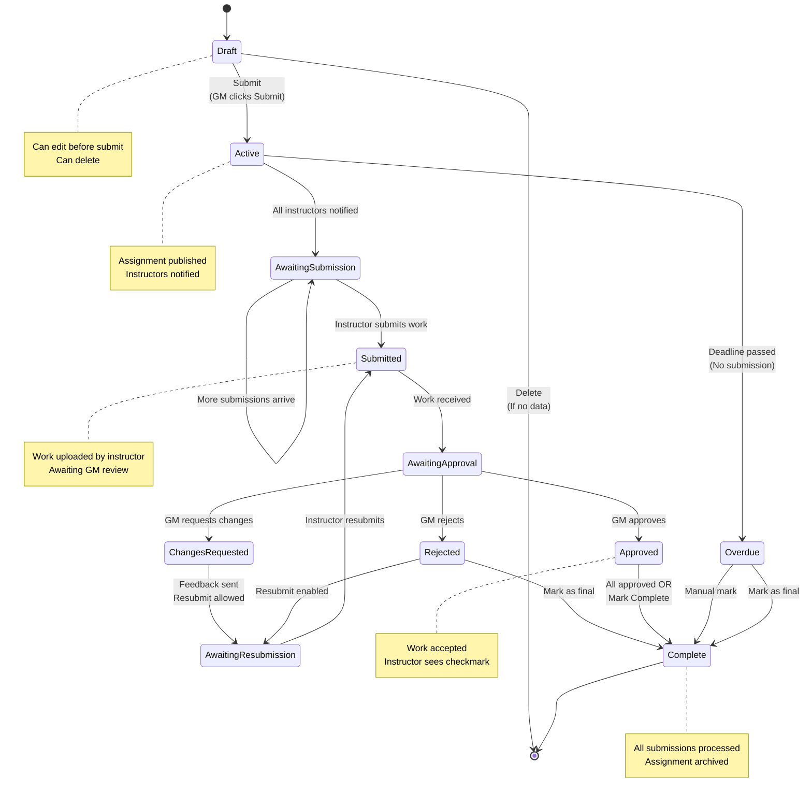
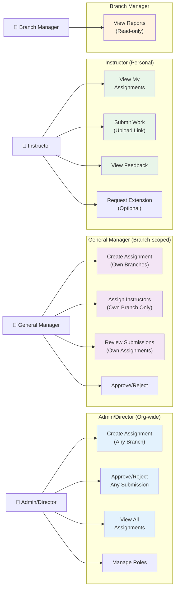
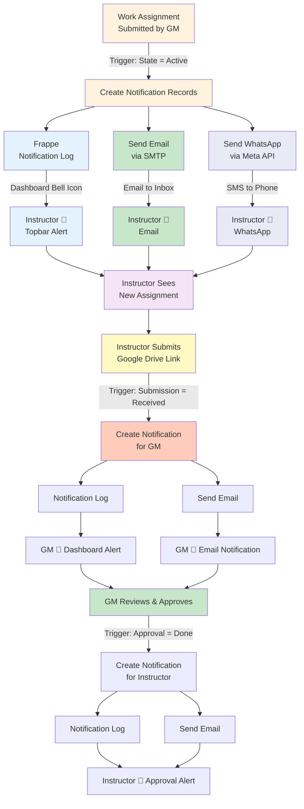
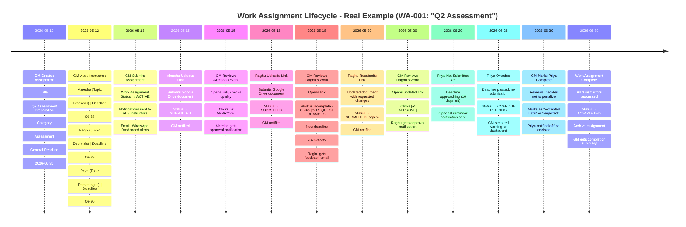
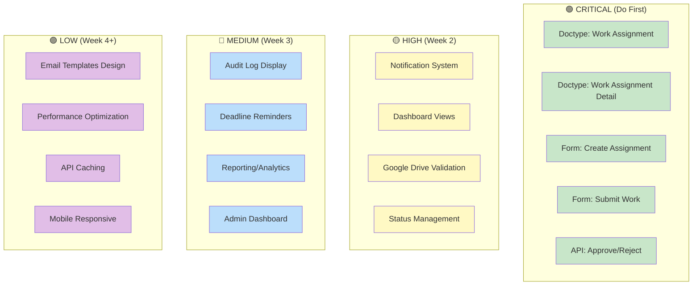

# 🎯 Work Assignment Feature - Visual Workflows

## 1. Complete Workflow Diagram



---

## 2. Instructor's Perspective (Swimlane)



---

## 3. General Manager's Perspective (Swimlane)



---

## 4. Status State Machine



---

## 5. Role & Permission Access Map



---

## 6. Notification Flow Diagram



---

## 7. Google Drive Integration Flow

```mermaid
graph LR
    A["Instructor<br/>Dashboard"] -->|Clicks 'Upload'| B["Modal Opens:<br/>Paste Link"]
    
    B -->|Enters URL| C{"Validate<br/>Format"}
    
    C -->|Invalid| D["❌ Error Toast<br/>Invalid Link"]
    D -->|Fix| B
    
    C -->|Valid| E["✅ Link Accepted<br/>Extract Metadata"]
    
    E -->|Optional| F["Fetch File Info<br/>from Google API"]
    F --> G["Show File Preview<br/>(Name, Size)"]
    
    E --> H["Instructor<br/>Submits"]
    G --> H
    
    H -->|API Call| I["Backend Validates<br/>& Stores URL"]
    
    I -->|Success| J["✅ Submission Recorded<br/>Status = Submitted"]
    
    J -->|Notify GM| K["GM Gets Alert"]
    
    K -->|GM Clicks<br/>View Link| L["Opens in<br/>Google Drive<br/>New Tab"]
    
    L -->|Reviews| M["Reads/Downloads<br/>File"]
    
    M -->|Decision| N{"Approve?"}
    
    N -->|Yes| O["Click [✅ Approve]"]
    N -->|No| P["Click [❌ Reject]<br/>or [⚠️ Changes]"]
    
    O --> Q["Backend Records<br/>Approval"]
    P --> R["Backend Records<br/>Feedback"]
    
    Q --> S["Instructor<br/>Notified"]
    R --> S
    
    style A fill:#e8f5e9
    style B fill:#fff9c4
    style C fill:#ffe0b2
    style E fill:#c8e6c9
    style J fill:#c8e6c9
    style K fill:#fff9c4
    style L fill:#bbdefb
    style O fill:#c8e6c9
    style P fill:#ffcdd2
```



---

## 8. Timeline Example: Full Scenario



---

## 9. Data Model Relationships

```mermaid
erDiagram
    USER ||--o{ WORK_ASSIGNMENT : creates
    WORK_ASSIGNMENT ||--|{ WORK_ASSIGNMENT_DETAIL : contains
    WORK_ASSIGNMENT ||--o{ COMPANY : "for_branch"
    WORK_ASSIGNMENT_DETAIL ||--o{ INSTRUCTOR : "assigned_to"
    WORK_ASSIGNMENT_DETAIL ||--o{ EMPLOYEE : "via_instructor"
    INSTRUCTOR ||--o{ EMPLOYEE : "links"
    INSTRUCTOR ||--o{ INSTRUCTOR_LOG : "contains"
    INSTRUCTOR_LOG ||--o{ COMPANY : "custom_branch"
    USER ||--o{ NOTIFICATION_LOG : "receives"
    WORK_ASSIGNMENT ||--o{ NOTIFICATION_LOG : "triggers"
    
    USER : string name
    USER : string email
    USER : string full_name
    USER : string role
    
    WORK_ASSIGNMENT : string name
    WORK_ASSIGNMENT : string title
    WORK_ASSIGNMENT : string description
    WORK_ASSIGNMENT : string category
    WORK_ASSIGNMENT : string for_branch
    WORK_ASSIGNMENT : date general_deadline
    WORK_ASSIGNMENT : string workflow_state
    WORK_ASSIGNMENT : int total_assigned
    WORK_ASSIGNMENT : int submitted_count
    WORK_ASSIGNMENT : int approved_count
    
    WORK_ASSIGNMENT_DETAIL : string instructor
    WORK_ASSIGNMENT_DETAIL : string unique_topic
    WORK_ASSIGNMENT_DETAIL : date assignment_deadline
    WORK_ASSIGNMENT_DETAIL : string priority
    WORK_ASSIGNMENT_DETAIL : string submission_status
    WORK_ASSIGNMENT_DETAIL : text google_drive_link
    WORK_ASSIGNMENT_DETAIL : string approval_status
    WORK_ASSIGNMENT_DETAIL : text approval_remarks
    
    INSTRUCTOR : string name
    INSTRUCTOR : string employee
    INSTRUCTOR : string status
    
    EMPLOYEE : string name
    EMPLOYEE : string employee_name
    
    COMPANY : string name
    COMPANY : string company_name
    
    NOTIFICATION_LOG : string name
    NOTIFICATION_LOG : string for_user
    NOTIFICATION_LOG : string document_type
    NOTIFICATION_LOG : string document_name
    NOTIFICATION_LOG : string subject
```

---

## 10. Implementation Priority Matrix



---

**Visual Guide Complete!**  
Use these diagrams alongside [WORK-ASSIGNMENT-FEATURE.md](WORK-ASSIGNMENT-FEATURE.md) for full understanding.
