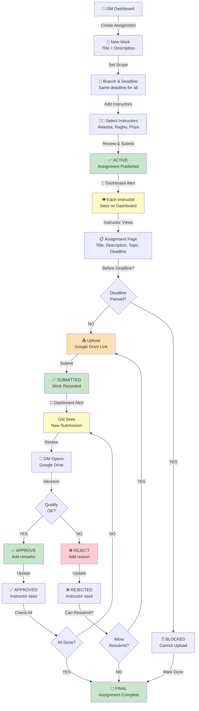
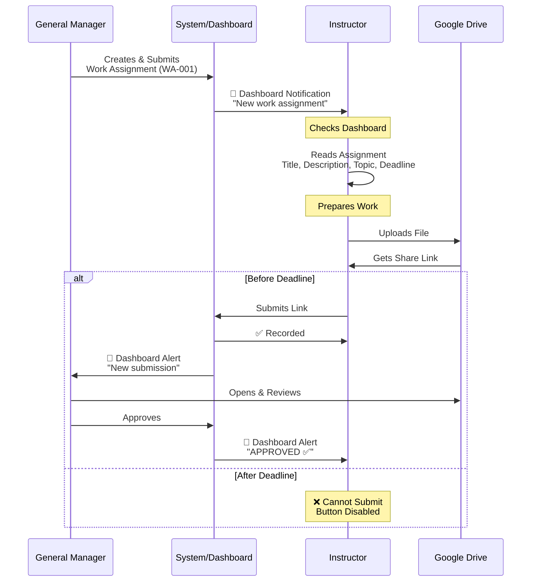
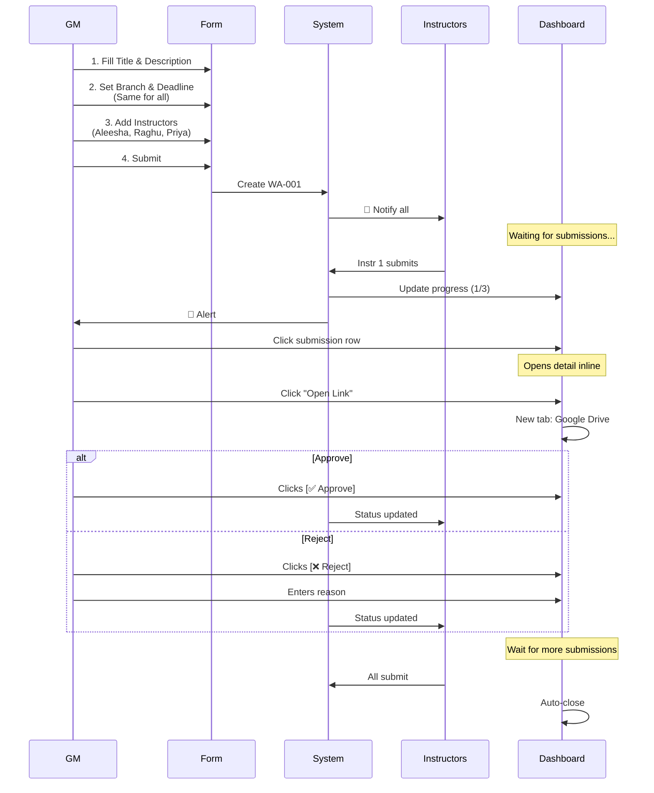
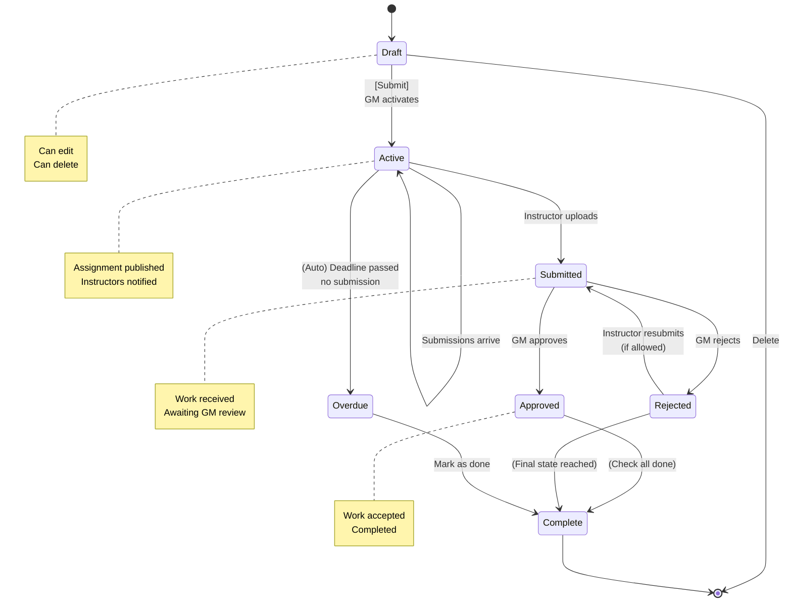
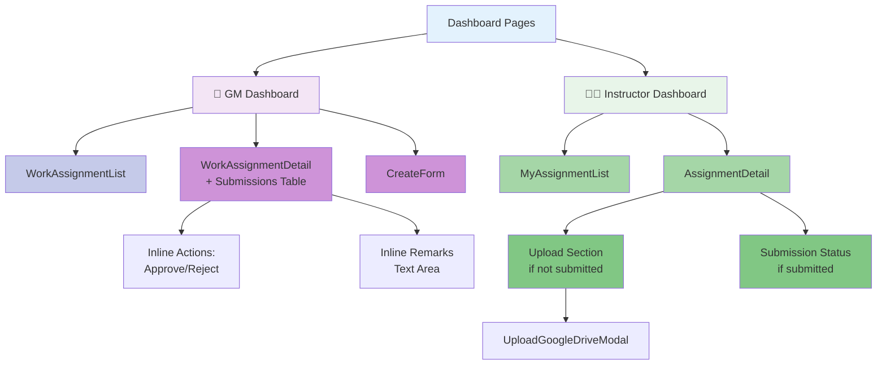
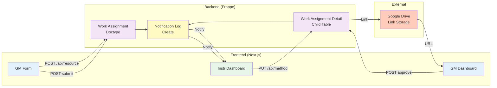
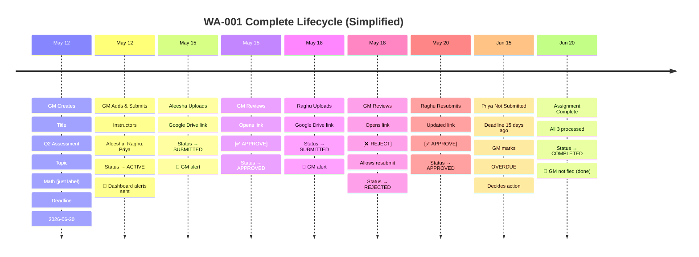
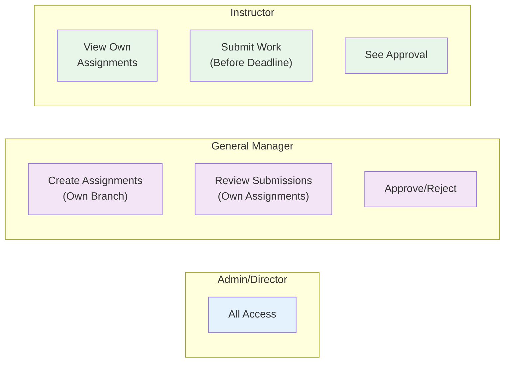
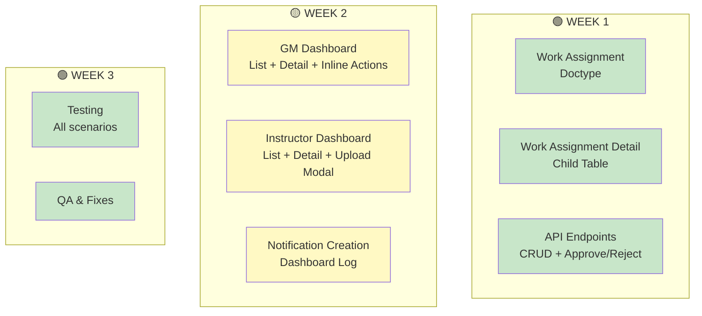

# 🎯 Work Assignment Feature - v2 SIMPLIFIED WORKFLOWS

**Version**: 2.0 (Simplified - Dashboard Only)  
**Changes**: No Email/WhatsApp, Topic is just a label, Same deadline for all

---

## 1. Simplified Main Workflow



---

## 2. Instructor's Simple Workflow



---

## 3. GM's Simplified Workflow



---

## 4. Simplified Status States



---

## 5. Notification Flow (Dashboard Only)

```mermaid
graph LR
    A["GM Submits<br/>Assignment"] -->|Trigger| B["Create Notification<br/>Dashboard Log"]
    
    B --> C1["Instr 1 🔔"]
    B --> C2["Instr 2 🔔"]
    B --> C3["Instr 3 🔔"]
    
    C1 --> D["Dashboard<br/>Bell Icon"]
    C2 --> D
    C3 --> D
    
    D --> E["Click to view<br/>assignment"]
    
    E --> F["Submit<br/>Work"]
    
    F -->|Trigger| G["Notify GM<br/>New Submission"]
    
    G --> H["GM 🔔<br/>Dashboard"]
    
    H --> I["Review &<br/>Approve"]
    
    I -->|Trigger| J["Notify Instr<br/>Approval Done"]
    
    J --> K["Instr 🔔<br/>Dashboard"]
    
    style A fill:#fff3e0
    style B fill:#e3f2fd
    style C1 fill:#e3f2fd
    style C2 fill:#e3f2fd
    style C3 fill:#e3f2fd
    style D fill:#bbdefb
    style F fill:#fff9c4
    style G fill:#ffccbc
    style H fill:#ffb74d
    style I fill:#c8e6c9
    style J fill:#ffccbc
    style K fill:#bbdefb
    
    note right of B
        Frappe Notification Log
        NO Email
        NO WhatsApp
    end note
```

---

## 6. Component Hierarchy (Simplified)



---

## 7. Data Flow (Simplified)



---

## 8. Real Example Timeline



---

## 9. Permission Access Map (Simplified)



---

## 10. Implementation Priority (Simplified)



---

## Summary of Simplifications

### ✅ What's Still Included
- ✅ Multi-branch support
- ✅ Assignment creation & activation
- ✅ Instructor assignment
- ✅ Google Drive link submission
- ✅ GM approval workflow
- ✅ Status tracking
- ✅ Dashboard notifications

### ❌ What's Removed
- ❌ Email notifications
- ❌ WhatsApp notifications
- ❌ Unique topic requirement
- ❌ Individual deadlines per instructor
- ❌ Priority levels
- ❌ Estimated hours
- ❌ Complex modal workflows

### 🟢 Result
- **Simpler code** - Less logic, fewer edge cases
- **Faster delivery** - 11-14 days vs 4-5 weeks
- **Easier testing** - Fewer scenarios
- **Cleaner UX** - Inline actions vs modals
- **True MVP** - Core features only

---

**These diagrams work with [WORK-ASSIGNMENT-REVISED-v2.md](WORK-ASSIGNMENT-REVISED-v2.md)**

Ready to implement!
